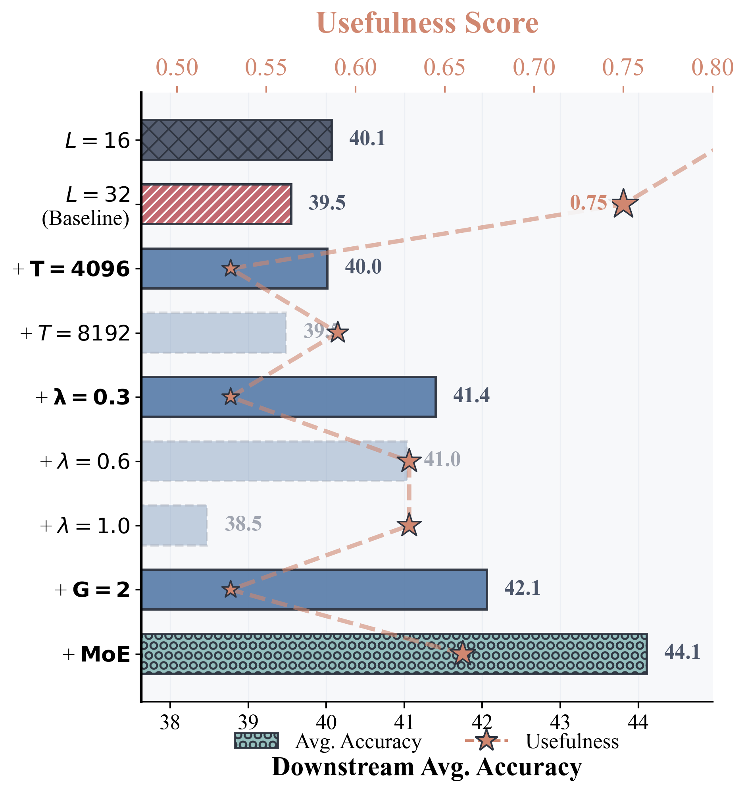

<h1 align="center">When Does Sparsity Mitigate the Curse of Depth in LLMs?</h1>

<p align="center">
  <!-- <a href="https://arxiv.org/abs/2503.00743">
    
  </a> -->
  <a href="https://github.com/yourusername/SparsityAndCoD/blob/main/LICENSE">
    
  </a>
</p>

<p align="center">
  
</p>

<p align="center">
  <b>Sparsity as a Variance Regulator for Improved Depth Utilization in Language Models</b>
</p>

---

## Overview

This repository contains the official implementation for our research on understanding how sparsity mechanisms mitigate the curse of depth in large language models. We reveal sparsity as a **variance regulator** that improves depth utilization beyond its conventional role in computational efficiency.

Our investigation covers:
- **Implicit Sparsity**: Weight sparsity induced by weight decay, attention sparsity from long contexts
- **Explicit Sparsity**: Key/value-sharing in Grouped-Query Attention (GQA), expert activation in Mixture-of-Experts (MoE)

Through controlled depth-scaling experiments, we demonstrate that sparsity consistently reduces output variance and promotes functional differentiation across layers.

---

## 📰 News

- **[2026-02]** Initial codebase release with training and evaluation scripts

---

## 📋 Table of Contents

- [Overview](#overview)
- [News](#news)
- [Installation](#installation)
- [Getting Started](#getting-started)
  - [Data Preparation](#data-preparation)
  - [Configuration](#configuration)
- [Training](#training)
- [Evaluation](#evaluation)
  - [Checkpoint Conversion](#checkpoint-conversion)
  - [Downstream Evaluation](#downstream-evaluation)
- [Analysis Tools](#analysis-tools)
- [Acknowledgments](#acknowledgments)
- [License](#license)

---

## 🛠️ Installation

### Prerequisites

- Python 3.10 or higher
- CUDA-capable GPU(s) for training (recommended)
- At least 50GB disk space for datasets and checkpoints

### Setup Environment

```bash
# Create virtual environment
python -m venv sparsity_cod
source sparsity_cod/bin/activate

# Install PyTorch
pip install torch==2.7.1

# Install the main package
git clone <repository-url>
cd SparsityAndCoD
pip install -e .

# Install optional dependencies
pip install flash-attn --no-build-isolation
pip install datasets matplotlib scikit-learn torchmetrics wandb

# Install evaluation harness (optional)
pip install -e lm-evaluation-harness
```

---

## 🚀 Getting Started

### Data Preparation

We provide a helper script for tokenizing HuggingFace datasets into the OLMo-compatible format:

**Script**: [`scripts/tokenize_from_dataset.py`](./scripts/tokenize_from_dataset.py)

```bash
python scripts/tokenize_from_dataset.py \
    --dataset_name HuggingFaceFW/fineweb-edu \
    --dataset_config sample_100BT \
    --split "train" \
    --max_tokens 10_000_000_000 \
    --output_dir ./tokenized_data \
    --tokenizer_identifier ./tokenizer/tokenizer.json
```

**Note**: You can download the GPT-NeoX tokenizer from the [OLMo HuggingFace repository](https://huggingface.co/allenai/OLMo-1B-0724-hf/blob/main/tokenizer.json).

### Configuration

We provide pre-configured YAML files for various model architectures used in our experiments:

| Configuration | Description | Parameters |
|--------------|-------------|------------|
| [`adamw-1B.yaml`](./configs/adamw-1B.yaml) | Primary 1B parameter dense model | 1B |
| [`adamw-400M-momentum.yaml`](./configs/adamw-400M-momentum.yaml) | Model for higher-order momentum analysis | 400M |
| [`olmoe-1B-7B.yaml`](./configs/olmoe-1B-7B.yaml) | 1B activated MoE with 7B total | 1B/7B |
| [`olmoe-400M-2B.yaml`](./configs/olmoe-400M-2B.yaml) | 400M activated MoE with 2B total | 400M/2B |
| [`olmoe-1B-7B-ablation.yaml`](./configs/olmoe-1B-7B-ablation.yaml) | Ablation study configuration | 1B/7B |

---

## 🏋️ Training

### Training Script

We provide an easy-to-use training script at [`scripts/train_script.sh`](./scripts/train_script.sh):

```bash
bash scripts/train_script.sh <config> <batch_size> <global_batch> <lr> <gpus> <port> <suffix>
```

**Arguments**:
| Argument | Description | Example |
|----------|-------------|---------|
| `config` | Configuration file name (without .yaml) | `adamw-1B` |
| `batch_size` | Per-device batch size | `16` |
| `global_batch` | Global batch size | `256` |
| `lr` | Learning rate | `1e-3` |
| `gpus` | Visible GPU IDs | `0,1,2,3,4,5,6,7` |
| `port` | Master port (optional) | `29500` |
| `suffix` | Run suffix for logging (optional) | `1B-Training` |

**Example**:
```bash
bash scripts/train_script.sh adamw-1B 16 256 1e-3 0,1,2,3,4,5,6,7 29500 1B-Training
```

### Training Configuration

Key training parameters you may want to customize:

```bash
--model.max_sequence_length=1024    # Training sequence length
--optimizer.weight_decay=0.1        # Weight decay coefficient
--data.dir=./tokenized_data         # Path to tokenized dataset
--tokenizer.identifier=./tokenizer/tokenizer.json
--save_folder="./runs/${config}-${suffix}"
--max_duration=5e9T                 # Total training tokens
--wandb.project="YourProject"       # Weights & Biases project
--layerwise_statis_collect_interval=1  # Variance collection frequency
```

---

## 📊 Evaluation

### Checkpoint Conversion

Convert OLMo checkpoints to HuggingFace format for evaluation:

**Dense Models**:
```bash
python scripts/convert_tools/convert_olmo_hf.py \
    --input_dir /path/to/olmo/checkpoint \
    --tokenizer_json_path /path/to/tokenizer.json \
    --output_dir /path/to/output
```

**MoE Models**:
```bash
python scripts/convert_tools/convert_olmo_moe_hf.py \
    --input_dir /path/to/olmo/moe/checkpoint \
    --tokenizer_json_path /path/to/tokenizer.json \
    --output_dir /path/to/output
```

### Downstream Evaluation

Using the [lm-evaluation-harness](https://github.com/EleutherAI/lm-evaluation-harness) (Make sure you install the local version):

```bash
python -m lm_eval \
    --model hf \
    --model_args pretrained=/path/to/hf/model \
    --tasks mmlu,hellaswag,arc_challenge \
    --batch_size auto \
    --output_path ./eval_results
```

## 🔬 Analysis Tools

We provide several analysis scripts for investigating sparsity patterns:

| Script | Purpose | Usage |
|--------|---------|-------|
| `analyze_weight_sparsity.py` | Analyze weight magnitude distributions | For studying implicit weight sparsity |
| `analyze_attention_sparsity.py` | Analyze attention pattern sparsity | For studying implicit sequence-wise sparsity |
| `analyze_weight_decay_sparsity.py` | Compare sparsity across weight decay values | For ablation studies |

Example:
```bash
python scripts/analysis_script/analyze_attention_sparsity.py \
    --model_path /path/to/model \
    --output_dir ./analysis_results
```

---

## 🙏 Acknowledgments

This project builds upon the excellent work of:

- [**OLMo**](https://github.com/allenai/OLMo) - Open Language Model from the Allen Institute for AI
- [**OLMoE**](https://github.com/allenai/OLMoE) - Mixture-of-Experts extension to OLMo
- [**lm-evaluation-harness**](https://github.com/EleutherAI/lm-evaluation-harness) - Framework for evaluating language models

We are grateful to the maintainers and contributors of these open-source projects.

---

## 📄 License

This project is licensed under the Apache License 2.0 - see the [LICENSE](./LICENSE) file for details.

---

<p align="center">
  If you find this repository helpful, please give us a ⭐ on GitHub!
</p>